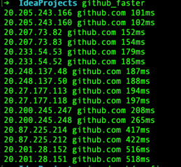

# go github faster

get github faster ip

[go github faster](https://github.com/lizongying/go-github-faster)

## Usage

* -q 安静模式，不输出连接时间。默认输出连接时间
* -p 测试端口。默认22

* 

```shell
# mac arm
./releases/go_github_faster_darwin_arm64
```

## Build

```shell
make 
```

## 赞赏

